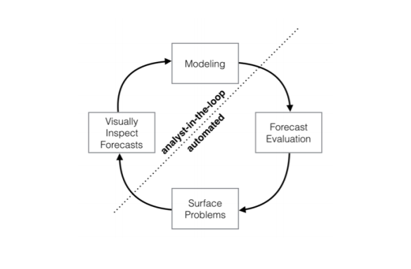

# Introduction

•       Prophet is open source software released by Facebook’s Core Data Science team. It is available for download on CRAN and PyPI.

•       Prophet is a procedure for forecasting time series data based on an additive model where non-linear trends are fit with yearly, weekly, and daily seasonality, plus holiday effects.

•       It works best with time series that have strong seasonal effects and several seasons of historical data.

•       Prophet is robust to missing data and shifts in the trend, and typically handles outliers well.

Accurate and fast.
--------------------------

•       Prophet is used in many applications across Facebook for producing reliable forecasts for planning and goal setting. We’ve found it to perform better than any other approach in the majority of cases. We fit models in Stan so that you get forecasts in just a few seconds.

Fully automatic.
--------------------------

•       Get a reasonable forecast on messy data with no manual effort. Prophet is robust to outliers, missing data, and dramatic changes in your time series.

Tunable forecasts.
--------------------------

•      The Prophet procedure includes many possibilities for users to tweak and adjust forecasts. You can use human-interpretable parameters to improve your forecast by adding your domain knowledge.

Available in R or Python.
--------------------------

•      We’ve implemented the Prophet procedure in R and Python, but they share the same underlying Stan code for fitting. Use whatever language you’re comfortable with to get forecasts.

# SUMMARY
-------------------------------------------------------------------------------------------------------------------------------------

•      Forecasting is a data science task that is central to many activities within an organization.For instance, organizations across all sectors of industry must engage in capacity planningto  eciently  allocate  scarce  resources  and  goal  setting  in  order  to  measure  performancerelative to a baseline.

•      We  describe  performance  analysesto compare and evaluate forecasting procedures, and automatically  ag forecasts formanual review and adjustment.  Tools that help analysts to use their expertise moste ectively enable reliable, practical forecasting of business time series.

•      First, completely automatic forecasting techniques can be hardto tune and are often too in exible to incorporate useful assumptions or heuristics.  Second,the analysts responsible for data science tasks throughout an organization typically havedeep domain expertise about the speci c products or services that they support, but oftendo  not  have  training  in  time  series  forecasting

•      Figure 1: Schematic view of the analyst-in-the-loop approach to forecasting at scale, which
best makes use of human and automated tasks 

•      
•     

